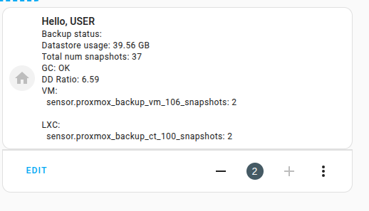

Add custom-repo in HACS
restart
add integration

## Setup:
```
host: https://<YOUR_HOST>:<PORT>
Token_id: get it from your pbs ( user@pbs!<token-name>)
token: The secret token from pbs
```
Dont forget to add permissions to the user as well as the token  

*Update_interval is set in "__init__.py" so far.  
 Will be added to UI-setup as well*


# Endpoints to be added:  
I'll start with those endpoints:  
```yaml
  /api2/json/admin
    /api2/json/admin/datastore  # Name of the datastore
    /api2/json/admin/gc
```

## so far:
```
Total snapshot count: sensor.proxmox_backup_total_snapshots
    Attr:
    total_snapshot_count: 36
    total_snapshot_size_bytes: 250832318571
    total_snapshot_size_human: 233.61 GB
    unit_of_measurement: snapshots
    device_class: count
    icon: mdi:backup-restore
    friendly_name: Proxmox Backup Total Snapshots

GC: OK
    Attr:
    store: Backups
    last_run_endtime: 2025-05-30T00:10:42
    next_run: 2025-05-31T00:00:00
    removed_bytes: 2899519552
    removed_chunks: 1685
    index_data_bytes: 250832284140
    disk_bytes: 39185929546
    deduplication_factor: 6.4
    icon: mdi:recycle
    friendly_name: Proxmox Backup GC Status Backups
VM: sensor.proxmox_backup_vm_105_snapshots: 2
    Attr:
    backup_type: vm
    backup_id: 105
    snapshot_count: 2
    total_snapshot_size_bytes: 68719478611
    total_snapshot_size_human: 64.00 GB
    latest_snapshot_comment: 106-hassos
    unit_of_measurement: snapshots
    device_class: count
    icon: mdi:backup-restore
    friendly_name: Proxmox Backup vm/105 Snapshots
LXC:sensor.proxmox_backup_ct_101_snapshots: 2
    Attr:
    backup_type: ct
    backup_id: 101
    snapshot_count: 2
    total_snapshot_size_bytes: 6130701190
    total_snapshot_size_human: 5.71 GB
    latest_snapshot_comment: 101-part-db
    unit_of_measurement: snapshots
    device_class: count
    icon: mdi:backup-restore
    friendly_name: Proxmox Backup ct/101 Snapshots
```

# Usage:  
```yaml
type: custom:mushroom-template-card
primary: Hello, {{ user }}
icon: mdi:home
secondary: >-
  Backup status:

  Datastore usage: {{ (states('sensor.proxmox_backup_backups_usage') | float /
  1073741824) | round(2) }} GB

  Total num snapshots: {{ states('sensor.proxmox_backup_total_snapshots') }}

  GC: {{ states('sensor.proxmox_backup_gc_status_backups') }}  

  DD Ratio: {{ state_attr('sensor.proxmox_backup_gc_status_backups',
  'deduplication_factor') }}

  VM:
    {{ entity.entity_id }}: {{ entity.state }}
  

  LXC: 
    {{ entity.entity_id }}: {{ entity.state }}
  
fill_container: false
multiline_secondary: true
```
This will render:  


# All Endpoint available:

```yaml  
/api2/json
  /api2/json/access
    /api2/json/access/acl
    /api2/json/access/domains
    /api2/json/access/openid
      /api2/json/access/openid/auth-url (Failed: 404)
      /api2/json/access/openid/login (Failed: 404)
    /api2/json/access/password (Failed: 404)
    /api2/json/access/permissions
    /api2/json/access/roles
    /api2/json/access/tfa
    /api2/json/access/ticket (Failed: 404)
    /api2/json/access/users
  /api2/json/admin
    /api2/json/admin/datastore
    /api2/json/admin/gc
    /api2/json/admin/metrics
    /api2/json/admin/prune
    /api2/json/admin/sync
    /api2/json/admin/traffic-control
    /api2/json/admin/verify
  /api2/json/backup (Failed: 400)
  /api2/json/config
    /api2/json/config/access
      /api2/json/config/access/ad
      /api2/json/config/access/ldap
      /api2/json/config/access/openid
      /api2/json/config/access/pam
      /api2/json/config/access/pbs
      /api2/json/config/access/tfa
        /api2/json/config/access/tfa/webauthn
    /api2/json/config/acme
      /api2/json/config/acme/account
      /api2/json/config/acme/challenge-schema
      /api2/json/config/acme/directories
      /api2/json/config/acme/plugins
      /api2/json/config/acme/tos
    /api2/json/config/changer
    /api2/json/config/datastore
    /api2/json/config/drive
    /api2/json/config/media-pool
    /api2/json/config/metrics
      /api2/json/config/metrics/influxdb-http
      /api2/json/config/metrics/influxdb-udp
    /api2/json/config/notifications
      /api2/json/config/notifications/endpoints
        /api2/json/config/notifications/endpoints/gotify
        /api2/json/config/notifications/endpoints/sendmail
        /api2/json/config/notifications/endpoints/smtp
        /api2/json/config/notifications/endpoints/webhook
      /api2/json/config/notifications/matcher-field-values
      /api2/json/config/notifications/matcher-fields
      /api2/json/config/notifications/matchers
      /api2/json/config/notifications/targets
    /api2/json/config/prune
    /api2/json/config/remote
    /api2/json/config/sync
    /api2/json/config/tape-backup-job
    /api2/json/config/tape-encryption-keys
    /api2/json/config/traffic-control
    /api2/json/config/verify
  /api2/json/nodes (Failed: 403)
  /api2/json/ping
  /api2/json/pull (Failed: 404)
  /api2/json/push (Failed: 404)
  /api2/json/reader (Failed: 400)
  /api2/json/status
    /api2/json/status/datastore-usage
    /api2/json/status/metrics
  /api2/json/tape
    /api2/json/tape/backup
    /api2/json/tape/changer
    /api2/json/tape/drive
    /api2/json/tape/media
      /api2/json/tape/media/content
      /api2/json/tape/media/destroy (Failed: 400)
      /api2/json/tape/media/list
      /api2/json/tape/media/media-sets
      /api2/json/tape/media/move (Failed: 404)
    /api2/json/tape/restore (Failed: 404)
    /api2/json/tape/scan-changers (Failed: 403)
    /api2/json/tape/scan-drives (Failed: 403)
  /api2/json/version

```


###  Feature:  
Added action to create a new release when pushed to main
should work now.